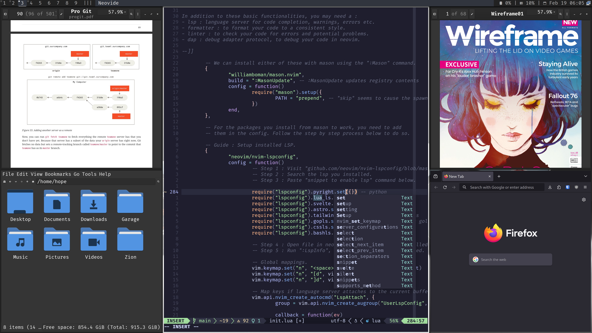
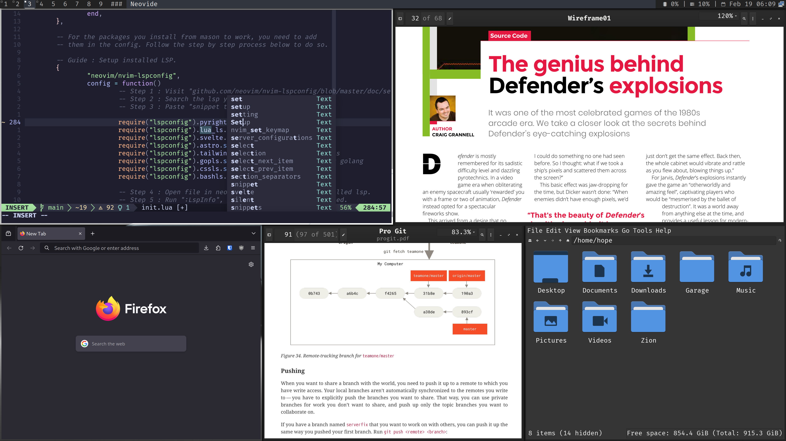

# Hope

Highly Optimised Productivity Environment ~ Scripts and dot files of my ever evolving arch setup. 

|      Screenshot 01      |      Screenshot 02      |
| :---------------------: | :---------------------: |
|  |  |

Features :

- uses [linux-zen](https://github.com/zen-kernel/zen-kernel) kernel.
- [multilib](https://wiki.archlinux.org/title/official_repositories#multilib) support.
- driver suport for [network](https://wiki.archlinux.org/title/NetworkManager), [bluetooth](https://wiki.archlinux.org/title/bluetooth), [audio](https://wiki.archlinux.org/title/PipeWire), [microcode](https://wiki.archlinux.org/title/Ryzen) & [gpu](https://wiki.archlinux.org/title/AMDGPU#Installation).
- multilingual font support with glyphs & emoticons.
- runs on [my pre-patched](https://github.com/commitsovercoffee/suckless) suckless apps ~ dwm, dmenu, slstatus & st.
- [fish](https://fishshell.com/) & [starship](https://starship.rs/) powered terminal.
- sane [dot files](https://github.com/commitsovercoffee/hope/tree/main/.config) for xinitrc, picom, touchpad etc.
- custom [keymaps](https://github.com/commitsovercoffee/hope?tab=readme-ov-file#keymaps) to minimize finger strain.

## What is it ?

Hope is your gateway to a personalized [arch Linux](https://archlinux.org/) environment in minutes. It's more than just an installation script, it's an automation tool that brings your ideal arch setup to life, pre-configured with your preferred dotfiles and settings.

- Pre-Configured : No need to spend hours tweaking configs. Hope installs your pre-defined dotfiles & settings, giving you your familiar and productive environment from the start.
- Customizable : It's designed to be easily adapted to your specific needs. You can tailor the script to match your unique preferences.


## Pre-requisite 

- [ ] Confirm your cpu & gpu both are from [team red](https://www.amd.com/en.html).
- [ ] Read the *fucking* script before using it.
- [ ] Realize that the script will [wipe](https://github.com/commitsovercoffee/hope/blob/main/install.sh#L19) your first nvme ssd.

## Pre-installation

- Download the arch iso from [this](https://archlinux.org/download/) page and [verify](https://wiki.archlinux.org/title/Installation_guide#Verify_signature) the signature of your download.
- Prepare the [USB flash installation medium](https://wiki.archlinux.org/title/USB_flash_installation_medium). (Do not use [these](https://wiki.archlinux.org/title/USB_flash_installation_medium#Inadvisable_methods) methods.)
- Disable `secure boot` & boot the live environment in UEFI mode.
- Connect to the internet by plugging in an ethernet cable or using [iwctl](https://wiki.archlinux.org/title/Iwd#Connect_to_a_network).

To check if you are connected to the internet. Run the command `ping archlinux.org`.

## Installation

Use the below command from a live arch installation environment to install & setup arch.

```bash
pacman -S git;
git clone https://github.com/commitsovercoffee/hope.git;
bash ./hope/install.sh;
```

After installation, temporary files will be cleaned up and your system will automatically restart into the new arch Linux installation. You'll be prompted to enter the username (hope) and password (that you set) to log in. Enjoy!

## What Next ?

<details><summary>Keymaps</summary>
<br>

Basic : 

`Alt` is the mod key & there are 1-9 workspaces.

- `Alt` + `d` : brings up dmenu to search apps.
- `Alt` + `Shift` + `q` : Quits current app.

Switch workspace :

- `Alt` + `1` : switch to workspace 1.
- `Alt` + `2` : switch to workspace 2.

Open apps : 

> The apps spawn based on [these](https://github.com/commitsovercoffee/suckless/blob/main/dwm/config.def.h#L36) rules which promotes efficient app switching by defining dedicated workspaces/tag for each application. This consistent layout helps build muscle memory, making you lightning-fast in navigating your tasks. Another reason why tiling window managers rock !

- `Alt` + `Shift` + `Enter` : Spawns terminal.
- `Alt` + `Shift` + `k` : Spawns file-manager.
- `Alt` + `Shift` + `p` : Spawns screenshot app.
- `Alt` + `Shift` + `n` : Spawns neovide.
- `Alt` + `Shift` + `v` : Spawns volume app.
- `Alt` + `Shift` + `b` : Spawns bluetooth app.

Select/resize apps : 

- `Alt` + `j/k` : Cycle through apps in current workspace.
- `Alt` + `h/l` : Increase/decrease width of current app.
  
Toggle float :

- `Alt` + `Space` toggles the layout between [horizgrid](https://dwm.suckless.org/patches/horizgrid/) & [threecolumn](https://dwm.suckless.org/patches/three-column/)
- `Alt` + `Shift` + `Space` toggles floating mode. You can hold `Alt` & drag/resize floating windows.
</details>

<details><summary>Change Appearance</summary>
<br>

- Use `lxappearance` to tweak the theme, icon, font, cursor etc.
- Use `font-manager` to download/install/uninstall fonts (including ones from [google fonts](https://fonts.google.com/)).

</details>

<details><summary>Change Shell Style</summary>
<br>

The script installs [fish shell](https://fishshell.com/) with [fisher](https://github.com/jorgebucaran/fisher) plugin manager and
[catppuccin theme](https://github.com/catppuccin/fish). If you don't like that theme. You can remove it :

```bash
fish -c "fisher remove catppuccin/fish"; # remove catpuccin theme
sudo pacman -Rns fisher; # remove plugin manager (in case you want to use omf)
```

And (maybe) opt for an alternative such as the [oh-my-fish](https://github.com/oh-my-fish/oh-my-fish) framework. To install one of [these](https://github.com/mrshu/oh-my-fish/blob/master/docs/Themes.md) themes.

</details>

<details><summary>Setup Neovim</summary>
<br>

Use below command to try my [neovim setup](https://github.com/commitsovercoffee/minima-nvim) :

```bash
git clone --depth 1 https://github.com/commitsovercoffee/minima-nvim ~/.config/nvim
```

After executing above command, open neovim (you will see a blank screen), wait till all plugins are installed.

</details>

<details><summary>Terminal Support in File Manager</summary>
<br>

The script installs [PcManFM](https://wiki.lxde.org/en/PCManFM) file manager. To enable terminal support (say) `st` in it :

- Open file manager by pressing `Alt + Shift + K`.
- Click on `Edit > Preferences > Advanced`.
- Type **st** in the `Terminal emulator` text field.
- Close the `Preferences` dialog box.

Now, you can press `F4` to open the current directory of the file manager in a terminal.

</details>

<details><summary>DNS Settings</summary>
<br>
 
For faster [domain name resolution](https://wiki.archlinux.org/title/Domain_name_resolution) :
- Replace `nameserver 192.168.1.1` with `nameserver 8.8.8.8` in /etc/resolv.conf file.<br>
- Prevent network manager from changing the file back using below command.

```bash
sudo chattr +i /etc/resolv.conf
```

</details>

<details><summary>KVM for virtual machines</summary>
<br>

If you work with VMs, use below commands for a quick KVM setup.

`fish shell does not support $, use bash for below commands`

```bash
sudo pacman -S virt-manager qemu vde2 ebtables dnsmasq bridge-utils openbsd-netcat
sudo systemctl enable libvirtd.service
sudo systemctl start libvirtd.service
sudo sed -i 's/#unix_sock_group = "libvirt"/unix_sock_group = "libvirt"/' /etc/libvirt/libvirtd.conf
sudo sed -i 's/#unix_sock_ro_perms = "0777"/unix_sock_ro_perms = "0777"/' /etc/libvirt/libvirtd.conf
sudo usermod -a -G libvirt $(whoami)
newgrp libvirt
sudo systemctl restart libvirtd.service
```

</details>

## Status

This project is my daily driver. I contribute to this project if and when I come across something useful or to add bugfixes.
