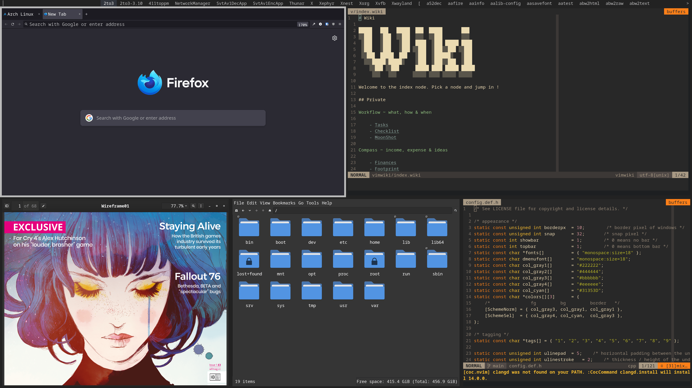
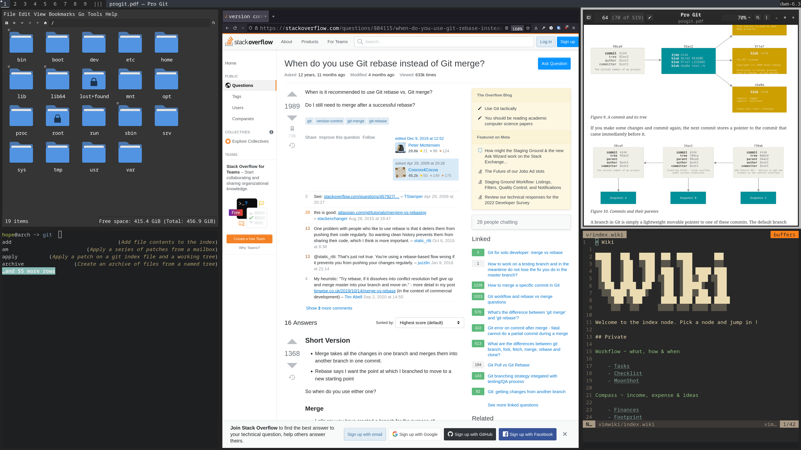

# Hope

Scripts and dot files to setup ( and document ) my ever evolving arch setup i.e **H**ighly **O**ptimised **P**roductivity **E**nvironment.

Installs base arch and sets up ...

- multilib for 32-bit apps.
- timezone and locale.
- user with sudo priviledges.
- network, bluetooth, audio and graphics.
- a friendly terminal (st, fish, tldr, neovim etc).
- a minimal graphical environment. (dwm, dmenu, picom, dunst etc).
- GRUB bootloader.
- dot files for xinitrc, picom, fish, neovim and touchpad,

and installs my recommended apps, if you reply `yes` to the suit prompt.

|      Screenshot 01      |      Screenshot 02      |
| :---------------------: | :---------------------: |
|  |  |

## Usage

> **Note :**
>
> - It installs drivers for AMD builds only.
> - It wipes the first NVMe SSD for installation.

Since, This is an automation script, not an installer.

> READ/EDIT THE SCRIPT BEFORE USING IT !

- Follow the steps below to install **my** setup.
- Or fork it, and use it as reference for your own remix.

## Pre-installation

- Download the arch iso from [this](https://archlinux.org/download/) page and [verify](https://wiki.archlinux.org/title/Installation_guide#Verify_signature) the signature of your download.
- Prepare the [USB flash installation medium](https://wiki.archlinux.org/title/USB_flash_installation_medium). (Do not use [these](https://wiki.archlinux.org/title/USB_flash_installation_medium#Inadvisable_methods) methods.)
- Disable `secure boot`. Boot the live environment in UEFI mode.
- Connect to the internet using one of following techniques :
  - Plug in an ethernet cable.
  - Authenticate to a wireless network using [iwctl](https://wiki.archlinux.org/title/Iwd#iwctl).
  - Connect to a mobile network with the [mmcli](https://wiki.archlinux.org/title/Mobile_broadband_modem#ModemManager) utility.

To check if you are connected to the internet. Run the command `ping archlinux.org`.

## Installation

Use the below command from a live arch installation environment to install and setup arch.

```
git clone https://github.com/commitsovercoffee/hope.git; bash ./hope/install.sh;
```

- You will be prompted a few times to specify the hostname, username, passwd etc.
- Once the installation is complete. The machine will automatically reboot into arch.
- You will reboot into TTY session where you can input your username and passkey to login.

## What Next ?

<details><summary>Change Appearance</summary>
<br>

- Use `lxappearance` to tweak the theme, icon, font, cursor etc.
- Use `font-manager` to download/install/uninstall fonts (including ones from [google fonts](https://fonts.google.com/)).

</details>

<details><summary>Change Shell Style</summary>
<br>

The script installs [fish shell](https://fishshell.com/) with [fisher](https://github.com/jorgebucaran/fisher) plugin manager and
[gruvbox theme](https://github.com/Jomik/fish-gruvbox). If you don't like that theme. You can remove it :

```bash
fish -c "fisher remove jomik/fish-gruvbox"; sudo pacman -Rns fisher
```

And (maybe) opt for an alternative such as :

- The [oh-my-fish](https://github.com/oh-my-fish/oh-my-fish) framework. To install one of [these](https://github.com/mrshu/oh-my-fish/blob/master/docs/Themes.md) themes.
- Alternatively, you can simply install a shell prompt like [tide](https://github.com/IlanCosman/tide).

</details>

<details><summary>Terminal Support in File Manager</summary>
<br>

The script installs [PcManFM](https://wiki.lxde.org/en/PCManFM) file manager. To enable terminal support (say) `st` in it :

- Open file manager by pressing `Alt + Shift + K`.
- Click on `Edit > Preferences > Advanced`.
- Type **st** in the `Terminal emulator` text field.
- Close the `Preferences` dialog box.

Now, you can press `F4` to open the current directory of the file manager in a terminal.

</details>

<details><summary>DNS Settings</summary>
<br>
 
For faster [domain name resolution](https://wiki.archlinux.org/title/Domain_name_resolution) :
- Replace `nameserver 192.168.1.1` with `nameserver 8.8.8.8` in /etc/resolv.conf file.<br>
- Prevent network manager from changing the file back using below command.

```bash
sudo chattr +i /etc/resolv.conf
```

</details>

<details><summary>KVM for virtual machines</summary>
<br>

If you work with VMs, use below commands for a quick KVM setup.

`fish shell does not support $, use bash for below commands`

```bash
sudo pacman -S virt-manager qemu vde2 ebtables dnsmasq bridge-utils openbsd-netcat
sudo systemctl enable libvirtd.service
sudo systemctl start libvirtd.service
sudo sed -i 's/#unix_sock_group = "libvirt"/unix_sock_group = "libvirt"/' /etc/libvirt/libvirtd.conf
sudo sed -i 's/#unix_sock_ro_perms = "0777"/unix_sock_ro_perms = "0777"/' /etc/libvirt/libvirtd.conf
sudo usermod -a -G libvirt $(whoami)
newgrp libvirt
sudo systemctl restart libvirtd.service
```

</details>

## Support

You can reach out to me on reddit : u/commitsovercoffee

## Status

This project is my daily driver. I contribute to this project if and when I come across something useful or to add bugfixes.
