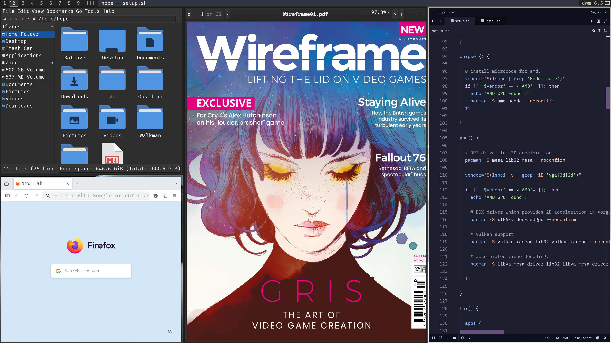

# Hope



Hope (Highly Optimised Productivity Environment) is a collection of scripts and dotfiles designed to automate my [arch linux](https://archlinux.org/) setup. It handles everything from base installation to app configuration, instantly recreating my entire workflow on any machine.

Feel free to use the steps below to replicate my environment or fork the repo to build your own.

## Pre-requisites

- [ ] Confirm Your CPU & GPU both are from [team red](https://www.amd.com/en.html).
- [ ] Realize that the script will [wipe](https://github.com/commitsovercoffee/hope/blob/301e5b76593e0f921a531058d802f506ce01bd4d/install.sh#L21) your first NVMe SSD.
- [ ] (Optional) Prepare emotionally. You may cry later if you didn’t read the line above.

## Usage

- Grab the arch ISO from [here](https://archlinux.org/download/).
- Create a bootable USB using [recommended methods](https://wiki.archlinux.org/title/USB_flash_installation_medium).
- Boot in UEFI mode with [Secure Boot Disabled](https://wiki.archlinux.org/title/Unified_Extensible_Firmware_Interface/Secure_Boot#Disabling_Secure_Boot).
- Connect to the internet via ethernet or wifi (with [iwctl](https://wiki.archlinux.org/title/Iwd#Connect_to_a_network)).
- Run below command from a live arch environment :

```bash
pacman -Sy git
git clone https://github.com/commitsovercoffee/hope.git
cd hope; bash install.sh
```

## Post Install

- Log in with the username "hope" and the password you set during setup.
- Feel frustrated that the default DWM keymaps don't work as expected.
- Look up my custom [keymaps](https://github.com/commitsovercoffee/dwm-remix/blob/18ea6642abae18e1c79c3359b02ee5e538a2a53a/config.def.h#L113).
- Live happily ever after.

### Optional Scripts

- `apps.sh`: Installs a curated list of applications and tools I commonly use.

```bash
bash <(curl -fsSL https://raw.githubusercontent.com/commitsovercoffee/hope/main/apps.sh)
```

- `code.sh`: Bootstraps the machine for software development.

```bash
bash <(curl -fsSL https://raw.githubusercontent.com/commitsovercoffee/hope/main/code.sh)
```

## Status

This setup is my daily driver. I update it whenever I find something useful or need to fix a bug.
